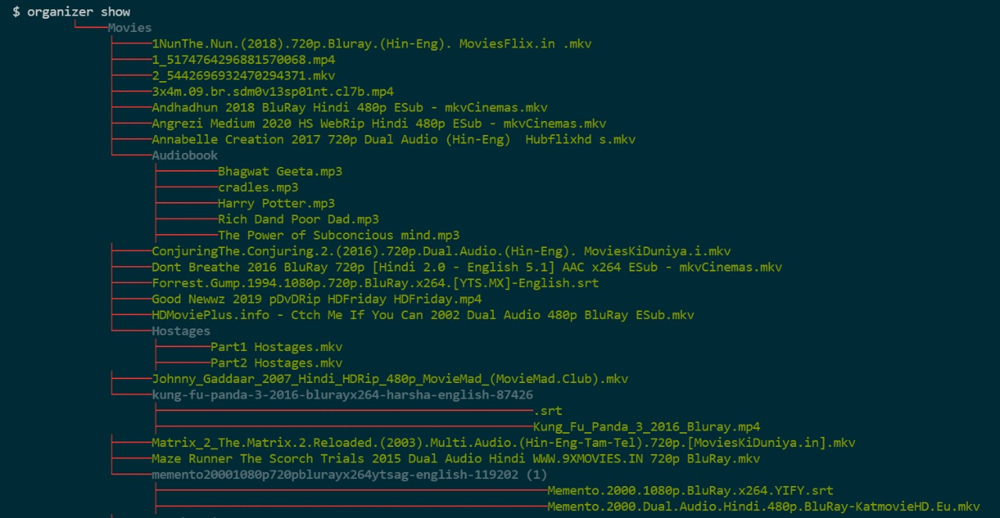
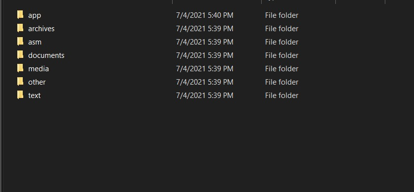

  <a href="https://github.com/kartikpapney/directory-organizer.git">
    <h3 align="center">Directory Organizer</h3>
  </a>

# About The Project

### A command line app using which you can get a tree view of your folder and organize your files in an organized folder according to their type[📺, 🔉, 📃 ...]. You can use this application to organize your downloads folder 😀.

# Commands
##### After linking the project in your machine. Open the downloads folder and perform the specific command.

### <b>organizer help</b>

##### This command will give you the list of commands in case you stuck

### <b>organizer show</b>

##### This command will give a tree view of the directory you are currently in.

    

### <b>organizer organize</b>

    

